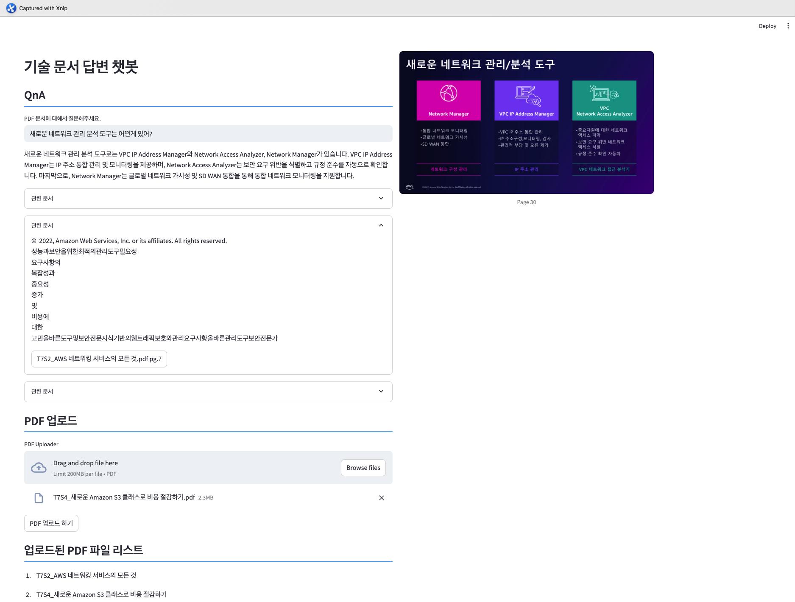
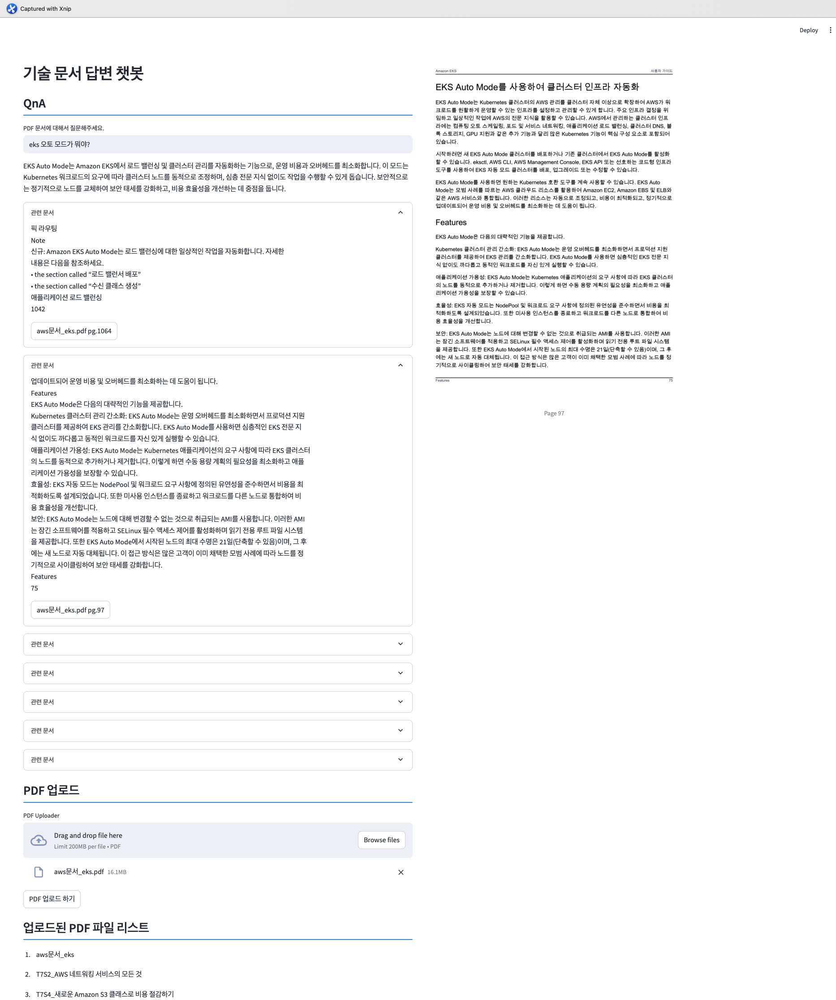

# 기술문서 RAG 챗봇

기술문서 RAG 챗봇은 기술 문서를 기반으로 사용자의 질문에 정확하게, 관련 문서의 지식을 활용하여 답변하는 대화형 AI 시스템입니다. 이 챗봇은 RAG(Retrieval-Augmented Generation) 기술을 활용하여 기존 문서에서 정보를 검색하고 이를 토대로 응답을 생성합니다.

## 필요조건
* Docker, Docker-compose
* 쿠버네티스 구성(쿠버네티스에 배포 시)

## 목표
### 구현
* pdf업로드
  * Embedding 후 Vector 저장
  * 여러개 pdf 파일 업로드
* 업로드된 pdf 파일 리스트
* QnA
  * 질문에 관련된 문서
  * 관련 문서 출력

### 미구현
* 다른 Ai Model 설정
  * Ollama, AmazonBedRock 등을 이용한 구현
  * 유동적 Model 설정
* Slack Chatbot 버전


## 사용법

### 공통
1. **리포지토리 클론**
   ```bash
   git clone https://github.com/juu0000/portfolio.git
   cd chatbot/rag-chatbot
   ```

2. **Docker 이미지 빌드 & 푸시**
   ```bash
   docker build -t chatbot:tag
   docker push chatbot:tag
   ```

### Docker Compose

1. **Docker-compose.yaml**
  * 환경 변수 값 설정
  ```yaml
  #chatbot/rag-chatbot/docker-compose.yaml
  services:
  chatbot:
    build:
      context: ./
      dockerfile: Dockerfile
    restart: always
    ports:
      - "20000:5000"
    environment:
      OPENAI_API_KEY: 1a2b3c4...
  ```

2. **실행**
  ```bash
  #/chatbot/rag-chatbot/
  docker-compose up
  ```

### Kubernetes

1. **OPENAI API KEY 설정**
* secret.yaml 수정
```yaml
#manifests/chatbot/secret.yaml
apiVersion: v1
kind: Secret
metadata:
  name: chatbot-sc
  namespace: ops-system
stringData:
  OPENAI_API_KEY: 1a2b3c4
```

2. **배포**
```bash
#manifests/chatbot
kubectl apply -f .
```

## 시연화면

* **질문1**



* **질문2**


