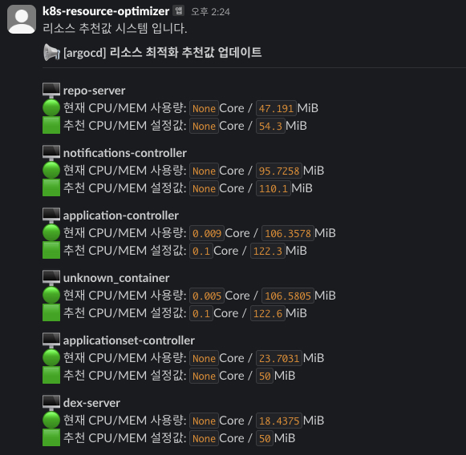

# Kubernetes Resource Optimizer

Kubernetes Resource Optimizer는 Kubernetes 클러스터에서 리소스를 효율적으로 관리하고 최적화하는 도구입니다. 이 도구는 Prometheus에서 수집한 CPU 및 메모리 사용량 데이터를 기반으로 최적의 리소스 요청 및 제한을 제안합니다.

## 필요조건
* 쿠버네티스 구성(쿠버네티스에 배포 시)
* 프로메테우스 구성

## 컨테이너 환경 설정

### Docker 빌드

1. **리포지토리 클론**
   ```bash
   git clone https://github.com/juu0000/portfolio.git
   cd k8s-resource-optimizer
   ```

2. **Docker 이미지 빌드 & 푸시**
   ```bash
   docker build -t k8s-resource-optimizer:tag
   docker push k8s-resource-optimizer:tag
   ```

3. **Kubernetes configmap & secret**
   * 환경변수 값 설정
    ```yaml
    #manifests/k8s-resource-optimizer/configmap.yaml
    apiVersion: v1
    kind: ConfigMap
    metadata:
      name: k8s-resource-optimizer-cm
      namespace: ops-system
    data:
      SLACK_CHANNEL: "example"
      PROMETHEUS_URL: "https://metric.example.xyz/"
    ```

     * 시크릿 설정
    ```yaml
    #manifests/k8s-resource-optimizer/secret.yaml
    apiVersion: v1
    kind: Secret
    metadata:
      name: k8s-resource-optimizer-sc
      namespace: ops-system
    stringData:
      SLACK_TOKEN: abcd...
    ```

### Kubernetes 배포
```bash
kubectl apply -f /manifests/k8s-resource-optimizer
```

## 로컬 환경 설정

1. **리포지토리 클론**
   ```bash
   git clone https://github.com/juu0000/portfolio.git
   cd k8s-resource-optimizer
   ```

2. **환경 변수 설정**
     * .env 생성 후 환경변수 값 설정 
      ```bash
      #k8s-resource-optimizer/.env
      PROMETHEUS_URL=http://example.com
      SLACK_WEBHOOK_URL=https://hooks.slack.com/services/EXAMPLE/EXAMPLE/EXAMPLE
      SLACK_TOKEN=xoxb-123...
      SLACK_CHANNEL="#example-channel"
      ```

3. **의존성 설치**
   ```bash
   pip install -r requirements.txt
   ```

### 사용법
#### Kubernetes 환경
1. CronJob 시간 설정
* cronjob.yaml
원하는 스케줄 시간과 측정할 네임스페이스값을 수정합니다.
네임스페이스값은 복수 설정이 가능합니다.

```yaml
apiVersion: batch/v1
kind: CronJob
metadata:
  name: k8s-resource-optimizer
  namespace: ops-system
spec:
  schedule: "0 0 * * 0"  # 이 설정은 매 분마다 작업을 실행합니다.
  timeZone: Asia/Seoul
  concurrencyPolicy: Replace
  jobTemplate:
    spec:
      template:
        metadata:
          labels:
            app.kubernetes.io/name: k8s-resource-optimizer
            application: k8s-resource-optimizer
        spec:
          restartPolicy: OnFailure
          containers:
            - name: k8s-resource-optimizer
              image: docconman/k8s-resource-optimizer:latest
              imagePullPolicy: IfNotPresent
              command:
                - /bin/sh
                - "-c"
                - "python3 run_recommender.py --n $NAMESPACE"
              env:
                - name: NAMESPACE
                  value: 'argocd jenkins istio'  # 이 값은 리소스를 최적화할 Kubernetes 네임스페이스를 지정합니다.
                - name: SLACK_CHANNEL
```

#### Local 환경
**실행**
   ```bash
   python run_recommender.py --namespace your-namespaces --record true
   ```

## 시연화면

* result
